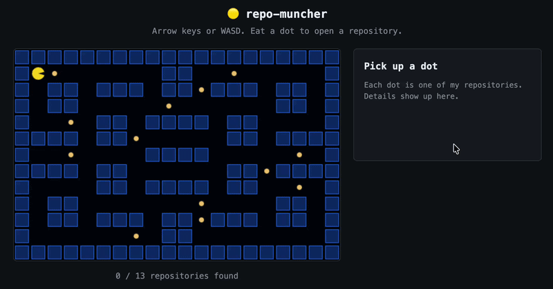

# Hi, I'm Yessmine 👋

M.Sc. Computer Engineering at TU Berlin — embedded systems, automation and simulation.

I work close to the hardware: firmware in C and C++, measurement and test, and the tooling
around it. Currently a working student in product management at Legalhero, previously at
Fraunhofer IPK and Sensirion Connected Solutions.

**What I'm working on**
- A smart ring for health monitoring — sensors, low power, and everything I keep reading about wearables
- A plant monitoring sensor, because apparently every CS student builds one eventually
- A chore organiser

**Tools I reach for**
`C` `C++` `Python` `MATLAB / Simulink` `ESP-IDF` `FreeRTOS` `CMake` `GitLab CI` `Linux` `LTspice` `KiCad`

**Elsewhere**
[LinkedIn](https://www.linkedin.com/in/yessmine-chabchoub) · chabchoub.yessmine@gmail.com

🇩🇪 German (C1) · 🇬🇧 English · 🇫🇷 French · 🇹🇳 Arabic

## 🟡 Browse my repos as a maze

Each dot is one of my repositories — eat it to see what it is. [Play it →](https://yessminech.github.io/repo-muncher/)